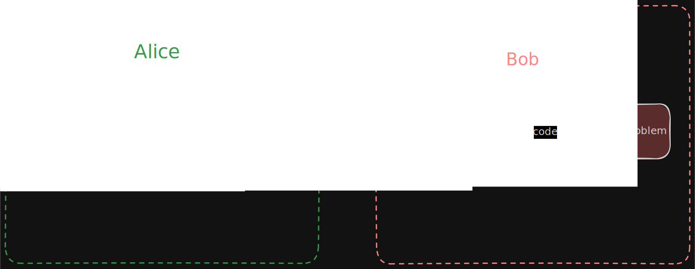
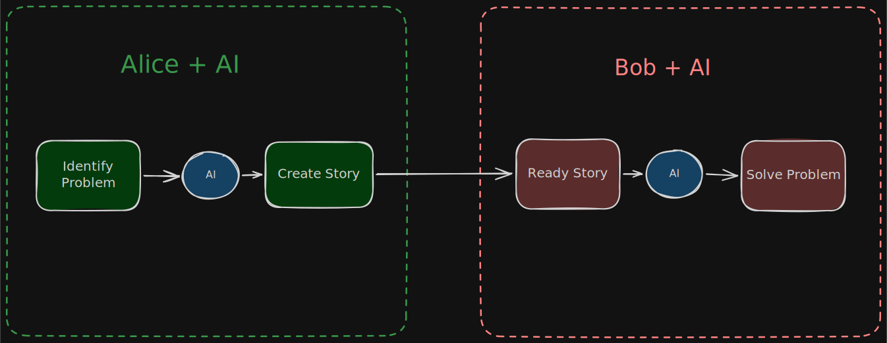
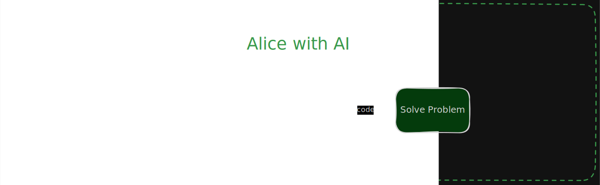
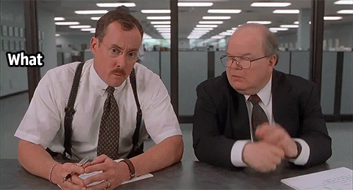

# Copilot Said So

**Author**: Eastwood  
**Date**: 2026-04-12  
**Status**: Draft

---

I have started to notice that engineers (including myself at times) are using excuses like "Copilot/Claude must have gotten confused" or "the AI got this wrong" when a code review turns up problems. It feels like it's becoming normalised — a reflex explanation that deflects responsibility away from the person who committed the code and onto the tool that suggested it.

On the surface it sounds reasonable, a "nit" if you will. Copilot *does* hallucinate. It does produce subtly wrong code. But the *excuse* misses the point entirely. Nobody forced you to accept the suggestion. The moment you committed it, it became yours.

## The Encode/Decode Problem

I keep coming back to a simple framing. Software development can be likened to a giant encoding and decoding step, and we do our best to make this lossless.

Without AI, the chain looks like this:

Alice encodes her understanding of the problem into a story. Bob decodes that story into working software. Each step involves interpretation, context, and judgment. The reason we pay developers well is that the decoding step is *hard* — it requires domain knowledge, wisdom and a healthy amount of reading between the lines, it's quite often lossy too.

With AI in the loop, the chain looks more like:

Every step has AI assistance. But the fundamental structure hasn't changed. *Someone* still has to supervise the output at each stage, *someone* still has to reduce the lossiness ("cost function" is perhaps more symbolic here). 

And this is the fundamental purpose of Bob, it's his job to make sure it's *correct*. Good job Bob!

## If Bob Can't Supervise, Alice Doesn't Need Bob

This is the part that frustrates me. If a developer's response to bad code is "Copilot said so", they're implicitly saying they couldn't tell the difference between correct and incorrect output, or they were too lazy to look. They accepted the suggestion without understanding it. They didn't decode — they forwarded.

But here's the thing: Alice can do that too. And without incurring any of the encoding and decoding cost.

If the developer is going to accept AI output without any meaningful supervision, then they're just adding an unnecessary hop. You're taking the *specifications from the customer and bringing them down to the software engineers*, remind you of anyone?

To be blunt: if Bob can't supervise or improve the AI's output better than Alice can, then Alice doesn't need Bob, and it's *more lossy*. The whole value proposition of the developer in this chain is their ability to evaluate, correct, and contextualise generated code. The moment they abdicate that responsibility — "Copilot said so" — they've argued themselves out of the process.

## What This Actually Means

The irony is that the developers who blame their tools are the ones most at risk of being replaced by them. The ones who treat AI output with the same rigour they'd apply to a junior developer's PR — reviewing, questioning, rewriting where needed — are the ones whose role gets *stronger*, not weaker.

I don't have a clean answer. But I think the right response is to hold the line on accountability. If the clanker makes a mistake, take ownership of it, be better. Your job isn't to type — it never was. It's to *know* whether the code is correct. 

So please, take accountability, take ownership and stop blaming the clankers. Because the moment we start blaming our tools, is the moment the tools will replace us.
